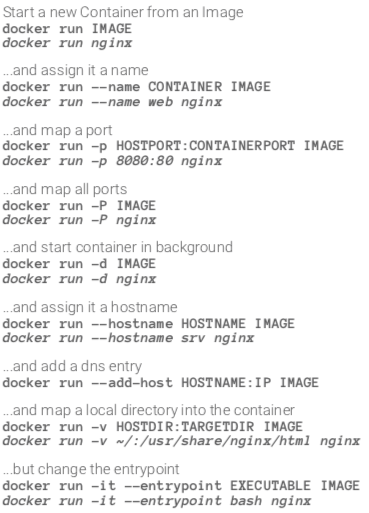
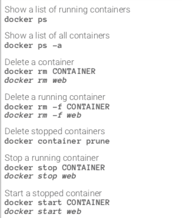
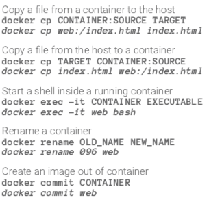
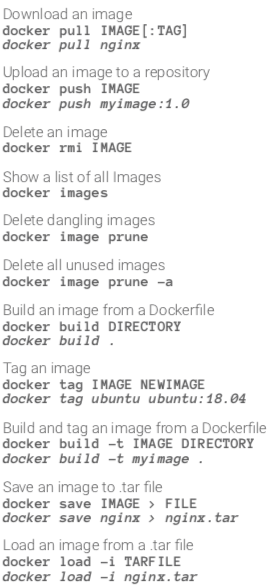

# Formation Docker

Formation proposé par Maxence Maireaux sur Openclassrooms : [Lien](https://openclassrooms.com/fr/courses/2035766-optimisez-votre-deploiement-en-creant-des-conteneurs-avec-docker)

# Table of Contents
1. [Différence VM et Conteneur](#vm_conteneur)
2. [Docker](#docker)
3. [Dockerfile](#dockerfile)
4. [Docker Hub](#dockerhub)
5. [Docker Compose](#dockercompose)


## Différence VM et Conteneur <a id='vm_conteneur'></a>

- Machine Virtuelle : Virtualisation lourde, où l'on crée à nouveau un système complet dans un système hôte pour qu'il ait ses propres ressources.  
(+) : Isolation totale avec l'hôte, Utilisation de plusieurs OS  
(-) : Temps de démarage important, Réservation de ressources sur le système hôte

- Conteneur : Virtualisation légère, où l'on ne virtualise pas les ressources mais uniquement les processus. Il y a donc partage des ressources entre conteneur et système hôte.  
(+) : Réservation de ressources nécessaires, Démarrage rapide  
(-) : Isolation partielle entre conteneur et OS

## Docker <a id='docker'></a>

Docker est un outil qui peut empaqueter une application et ses dépendances dans un conteneur isolé, qui pourra être exécuté sur n'importe quel serveur ». Il ne s'agit pas de virtualisation, mais de conteneurisation, une forme plus légère qui s'appuie sur certaines parties de la machine hôte pour son fonctionnement. Cette approche permet d'accroître la flexibilité et la portabilité d’exécution d'une application, laquelle va pouvoir tourner de façon fiable et prévisible sur une grande variété de machines hôtes, que ce soit sur la machine locale, un cloud privé ou public, une machine nue, etc

source: https://fr.wikipedia.org/wiki/Docker_(logiciel)

### Utilisation de Docker

- Déployer un projet
- Unifier l'environnement de développement entre les membres de l'équipe
- CI/CD (Intégration continue / Livraison continue)
- ...

### Caractéristique d'un conteneur

- Stateless : Un conteneur est sans état. Si un conteneur doit être stateful, il faut lui attribuer un espace de stockage pour persister l'information (ex: Base de données)
- Immuable : Si un changement doit être fait, il faut créer une nouvelle image et la déployer. On ne modifie pas un conteneur en cours de route.

### CLI

Docker Cheat Sheet : [Lien](https://dockerlabs.collabnix.com/docker/cheatsheet/)
Github récapitulatif : [Lien](https://github.com/wsargent/docker-cheat-sheet)

#### Lancement conteneur



#### Opérations conteneur existant





#### Opérations sur une image



#### Informations sur les conteneurs


## Dockerfile <a id='dockerfile'></a>

Le fichier Dockerfile décrit les caractéristique d'une image Docker. Une série d'instructions sont disponibles sur la [documentation](https://docs.docker.com/engine/reference/builder/).

Voici un exemple détaillé d'un Dockerfile, d'après le projet [Ghost-cms](https://github.com/OpenClassrooms-Student-Center/ghost-cms):
```bash
FROM debian:9

RUN apt-get update -yq \
&& apt-get install curl gnupg -yq \
&& curl -sL https://deb.nodesource.com/setup_10.x | bash \
&& apt-get install nodejs -yq \
&& apt-get clean -y

ADD . /app/
WORKDIR /app
RUN npm install

EXPOSE 2368
VOLUME /app/logs

CMD npm run start
```

Détail des instructions:  
- ```From``` : Définir l'image qui va être utilisé comme base. Cette instruction n'est disponible qu'une fois par fichier.
- ```Run``` : Exécuter une commande dans le conteneur.
- ```ADD``` : Copier ou télécharger des fichiers dans l'image.
- ```WORKDIR``` : Modifier le répertoire courant (équivalent de cd).
- ```EXPOSE``` : Ajouter de la lisibilité pour préciser sur quel port l'application écoute.
- ```VOLUME``` : Précise quel répertoire peut être partagé ou utilisé comme stockage de données persistentes. Discussion [Stackoverflow](https://stackoverflow.com/questions/41935435/understanding-volume-instruction-in-dockerfile) sur l'usage de l'instruction.
- ```CMD```  Précise la commande qui va être exécuté lors du démarrage du conteneur.

Pour créer une image et la déployer sur un conteneur, il faut se référencer au paragraphe précédent qui détail les différentes lignes de commandes possible via un cheat sheet.

### .dockerignore

Tout comme dans un projet utilisant git avec le .gitignore, certains fichiers ne doivent pas être ajouté lors de l'instruction ```ADD```.  
C'est dans le .dockerignore que l'on va ajouter le chemin vers les fichiers/dossiers pour qu'ils ne soient pas mis dans le conteneur.  
Exemple: Dans un projet Node.js, on ajoute les nodes_modules tout comme pour git.

## Docker hub <a id='dockerhub'></a>

### Definition

Docker Hub est un service web dans lequel les utilisateurs et les partenaires de Docker créent, testent, stockent et distribuent des images de conteneurs. Grâce à Docker Hub, un utilisateur peut accéder à des dépôts d'images publics et open source, ainsi qu'utiliser un espace pour créer ses propres dépôts privés, des fonctions de construction automatisées, des webhooks et des groupes de travail.

### CLI
- ```docker login``` : Pour se connecter à Docker Hub
- ```docker pull``` : Pour récupérer une image depuis le Docker Hub
- ```docker tag imageid/imagename yourhubusername/repository:tag``` : Pour tag une image local avec un repository sur le Docker Hub
- ```docker push yourhubusername/repository``` : Pour envoyer l'image sur le Docker Hub

## Docker Compose <a id='dockercompose'></a>

### Definition

Pour simplifier la gestion de l'infrastructure, vous souhaitez déployer l'ensemble des composants dans des conteneurs Docker. La CLI de Docker Compose et celui de Docker sont très proches. Pour utiliser la CLI de Docker Compose, nous avons besoin d'un fichier **docker-compose.yml**.

### CLI

- ```docker-compose up``` : Lancer la création des conteneurs.
- ```docker-compose ps``` : Permettant de visualiser l'état des conteneurs.
- ```docker-compose logs -f --tail 5``` : Permettant de voir les logs une fois que les conteneurs sont lancés.
- ```docker-compose stop``` : Permet d'arrêter une **stack** Docker Compose. Cela ne supprime pas les ressources allouées à la stack.
- ```docker-compose down``` : Supprime l'ensemble de la stack Docker Compose ainsi que les ressources allouées.
- ```docker-compose config``` : Permet de valider la syntaxe du fichier **docker-compose.yml**

### docker-compose.yml

#### Exemple

On cherche ici à lancer 2 conteneurs, mysql et wordpress, on obtient le fichier suivant:
```yml
version: '3'
services:
  db:
    image: mysql:5.7
    volumes:
      - db_data:/var/lib/mysql
    restart: always
    environment:
      MYSQL_ROOT_PASSWORD: somewordpress
      MYSQL_DATABASE: wordpress
      MYSQL_USER: wordpress
      MYSQL_PASSWORD: wordpress

  wordpress:
    depends_on:
      - db
    image: wordpress:latest
    ports:
      - "8000:80"
    restart: always
    environment:
      WORDPRESS_DB_HOST: db:3306
      WORDPRESS_DB_USER: wordpress
      WORDPRESS_DB_PASSWORD: wordpress
      WORDPRESS_DB_NAME: wordpress

volumes:
  db_data: {}
```

#### Explications

- version : Permet de spécifier la version de Docker Compose.
- services : Permet de créer la stack docker compose en précisant chacun des services que l'on souhaite créer.
- image : Permet de spécifier l'image docker que l'on souhaite utiliser.
- build : Permet de spécifier le lien vers un Dockerfile. Un conteneur sera construit avant d'être exécuté.
- volumes : Permet de spécifier un dossier dans lequel le conteneur stateful pourra persister ces données.
- restart : Permet de spécifier le comportement lors de l'arrêt innatendu du service.
- environment : Permet de spécifier des variables d'environnements propre à un conteneur. 
- depends_on : Permet de créer une dépendance entre deux conteneurs.
- ports : Permet de dire à Docker Compose qu'on veut exposer un port de notre machine hôte vers notre conteneur, et ainsi le rendre accessible depuis l'extérieur.
