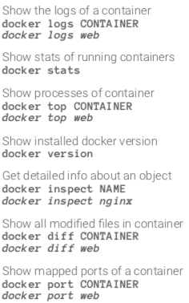

# Formation Docker

Formation proposé par Maxence Maireaux sur Openclassrooms : [Lien](https://openclassrooms.com/fr/courses/2035766-optimisez-votre-deploiement-en-creant-des-conteneurs-avec-docker)

## Différence VM et Conteneur

- Machine Virtuelle : Virtualisation lourde, où l'on crée à nouveau un système complet dans un système hôte pour qu'il ait ses propres ressources.  
(+) : Isolation totale avec l'hôte, Utilisation de plusieurs OS  
(-) : Temps de démarage important, Réservation de ressources sur le système hôte

- Conteneur : Virtualisation légère, où l'on ne virtualise pas les ressources mais uniquement les processus. Il y a donc partage des ressources entre conteneur et système hôte.  
(+) : Réservation de ressources nécessaires, Démarrage rapide  
(-) : Isolation partielle entre conteneur et OS

## Docker

Docker est un outil qui peut empaqueter une application et ses dépendances dans un conteneur isolé, qui pourra être exécuté sur n'importe quel serveur ». Il ne s'agit pas de virtualisation, mais de conteneurisation, une forme plus légère qui s'appuie sur certaines parties de la machine hôte pour son fonctionnement. Cette approche permet d'accroître la flexibilité et la portabilité d’exécution d'une application, laquelle va pouvoir tourner de façon fiable et prévisible sur une grande variété de machines hôtes, que ce soit sur la machine locale, un cloud privé ou public, une machine nue, etc

source: https://fr.wikipedia.org/wiki/Docker_(logiciel)

### Utilisation de Docker

- Déployer un projet
- Unifier l'environnement de développement entre les membres de l'équipe
- CI/CD (Intégration continue / Livraison continue)
- ...

### Caractéristique d'un conteneur

- Stateless : Un conteneur est sans état. Si un conteneur doit être stateful, il faut lui attribuer un espace de stockage pour persister l'information (ex: Base de données)
- Immuable : Si un changement doit être fait, il faut créer une nouvelle image et la déployer. On ne modifie pas un conteneur en cours de route.

### CLI

Docker Cheat Sheet : [Lien](https://dockerlabs.collabnix.com/docker/cheatsheet/)

#### Lancement conteneur


#### Opérations conteneur existant


#### Opérations sur une image


#### Informations sur les conteneurs



### Dockerfile

Le fichier Dockerfile décrit les caractéristique d'une image Docker. Une série d'instructions sont disponibles sur la [documentation](https://docs.docker.com/engine/reference/builder/).

Voici un exemple détaillé d'un Dockerfile, d'après le projet [Ghost-cms](https://github.com/OpenClassrooms-Student-Center/ghost-cms):
```bash
FROM debian:9

RUN apt-get update -yq \
&& apt-get install curl gnupg -yq \
&& curl -sL https://deb.nodesource.com/setup_10.x | bash \
&& apt-get install nodejs -yq \
&& apt-get clean -y

ADD . /app/
WORKDIR /app
RUN npm install

EXPOSE 2368
VOLUME /app/logs

CMD npm run start
```

Détail des instructions:  
- ```From``` : Définir l'image qui va être utilisé comme base. Cette instruction n'est disponible qu'une fois par fichier.
- ```Run``` : Exécuter une commande dans le conteneur.
- ```ADD``` : Copier ou télécharger des fichiers dans l'image.
- ```WORKDIR``` : Modifier le répertoire courant (équivalent de cd).
- ```EXPOSE``` : Ajouter de la lisibilité pour préciser sur quel port l'application écoute.
- ```VOLUME``` : Précise quel répertoire peut être partagé ou utilisé comme stockage de données persistentes. Discussion [Stackoverflow](https://stackoverflow.com/questions/41935435/understanding-volume-instruction-in-dockerfile) sur l'usage de l'instruction.
- ```CMD```  Précise la commande qui va être exécuté lors du démarrage du conteneur.

Pour créer une image et la déployer sur un conteneur, il faut se référencer au paragraphe précédent qui détail les différentes lignes de commandes possible via un cheat sheet.

#### .dockerignore

Tout comme dans un projet utilisant git avec le .gitignore, certains fichiers ne doivent pas être ajouté lors de l'instruction ```ADD```.  
C'est dans le .dockerignore que l'on va ajouter le chemin vers les fichiers/dossiers pour qu'ils ne soient pas mis dans le conteneur.  
Exemple: Dans un projet Node.js, on ajoute les nodes_modules tout comme pour git.
